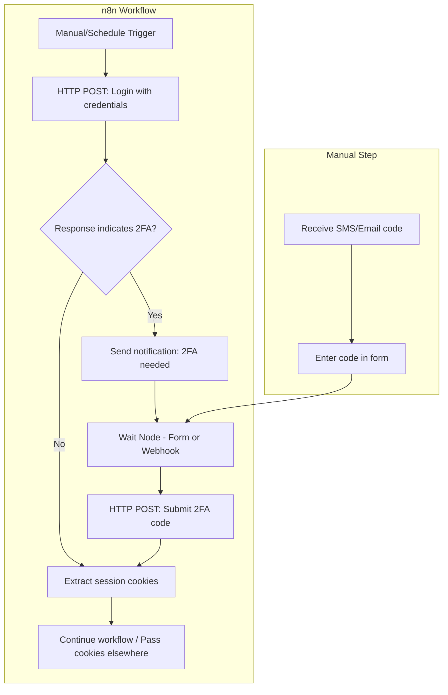
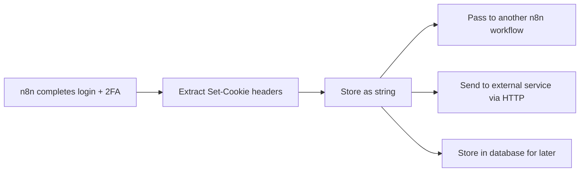
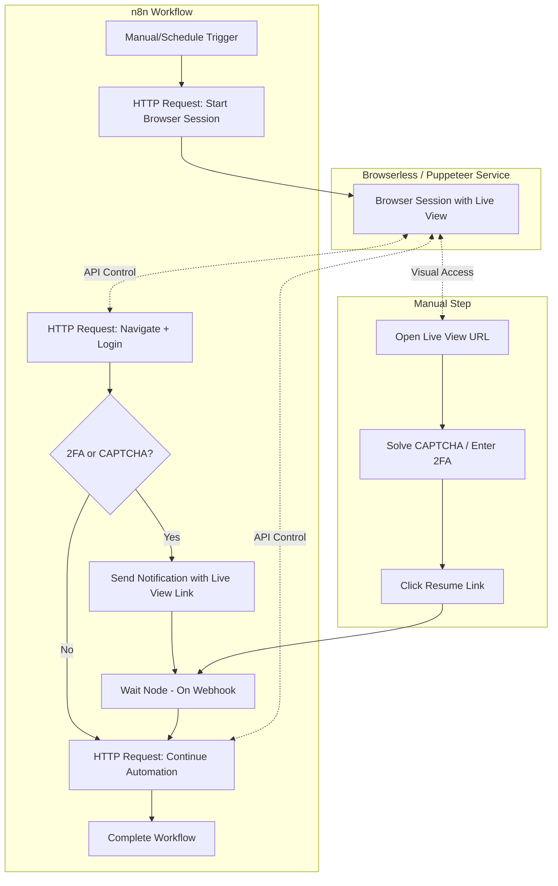
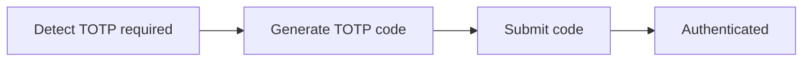

# n8n 2FA Human-in-the-Loop Architecture

## Overview

This plan covers two approaches for handling 2FA in n8n workflows:

1. **HTTP-based approach** (recommended for SMS/email 2FA) - simpler, no browser needed
2. **Browser-based approach** (for CAPTCHAs or complex JS-heavy sites) - requires visual access

---

## Approach 1: HTTP-Based (Recommended for SMS/Email 2FA)

For SMS or email-based 2FA codes, you do NOT need to see a browser. n8n can handle this entirely via HTTP requests. You simply provide the code via a form, and n8n submits it.

### Architecture



### n8n Nodes Required

1. **HTTP Request Node** - POST login credentials
   - URL: The service's login endpoint
   - Body: `{ "username": "...", "password": "..." }`
   - Important: Enable "Always Output Data" and check response headers

2. **IF Node** - Detect if 2FA is required
   - Check response body for indicators like `"2fa_required": true`
   - Or check for redirect to 2FA page
   - Or check HTTP status code (some use 202 or specific codes)

3. **Send Email / Slack / Telegram Node** - Notify you
   - Include a link to the form where you'll enter the code

4. **Wait Node** - Pause for user input
   - Mode: "On Form Submission" (n8n 1.0+) or "On Webhook Call"
   - The form collects the 2FA code from you

5. **HTTP Request Node** - Submit the 2FA code
   - URL: The service's 2FA verification endpoint
   - Body: `{ "code": "{{ $json.code }}" }`
   - Headers: Include session cookies from the login response

6. **Code Node** (optional) - Extract and format cookies for later use

### Workflow Logic Detail

**Phase 1: Login Attempt**
```
1. HTTP POST to /login (or /api/auth/login)
   - Send: username, password
   - Receive: session cookie + 2FA status
2. Store the Set-Cookie header for later use
```

**Phase 2: Detect 2FA Requirement**
```
3. IF Node checks response:
   - Body contains "2fa" or "verification" or "mfa"?
   - Status code is 202 or specific 2FA code?
   - Redirected to /verify or /2fa path?
```

**Phase 3: Wait for User Input**
```
4. Send notification (email/Slack) with form link
5. Wait Node pauses workflow
6. User receives SMS/email with code
7. User enters code in n8n form
8. Workflow resumes with the code
```

**Phase 4: Complete Authentication**
```
9. HTTP POST to /verify-2fa (or /api/auth/verify)
   - Send: the 2FA code
   - Include: session cookie from step 1
10. Receive: authenticated session cookie
11. Continue with authenticated requests
```

### Example HTTP Request Configuration

**Login Request:**
```
Method: POST
URL: https://service.com/api/login
Body (JSON): {
  "email": "{{ $json.email }}",
  "password": "{{ $json.password }}"
}
Headers: {
  "Content-Type": "application/json"
}
```

**2FA Submit Request:**
```
Method: POST
URL: https://service.com/api/verify-2fa
Body (JSON): {
  "code": "{{ $json.code }}"
}
Headers: {
  "Content-Type": "application/json",
  "Cookie": "{{ $node.Login.json.headers['set-cookie'] }}"
}
```

---

## Cookie Sharing Between Services

Cookies are just HTTP header strings. Once n8n completes authentication, you can extract and share the session cookies with other services.

### How It Works



### Extracting Cookies in n8n

After a successful HTTP Request, use a **Code Node** to extract cookies:

```javascript
// Extract cookies from the HTTP response
const response = $input.first().json;
const setCookieHeaders = response.headers['set-cookie'];

// Combine into a single cookie string for use in subsequent requests
const cookieString = setCookieHeaders
  .map(cookie => cookie.split(';')[0])  // Get just the key=value part
  .join('; ');

return {
  cookies: cookieString,
  // Example: "session_id=abc123; auth_token=xyz789"
};
```

### Using Cookies in Another Service

Any HTTP client can use the cookies by including them in the request header:

```
GET /api/protected-resource
Host: service.com
Cookie: session_id=abc123; auth_token=xyz789
```

In n8n, pass to another workflow via webhook:
```
POST https://your-n8n-instance/webhook/other-workflow
Body: { "cookies": "{{ $json.cookies }}" }
```

Or call an external service directly:
```
POST https://your-other-service.com/continue-task
Headers: { "X-Session-Cookies": "{{ $json.cookies }}" }
```

### Cookie Sharing Considerations

| Factor | What to Know |
|--------|--------------|
| **Expiration** | Cookies expire - check `max-age` or `expires` attributes |
| **IP binding** | Some services tie sessions to IP; may fail if different service has different IP |
| **User-Agent** | Some services check browser fingerprint; use consistent User-Agent header |
| **HttpOnly** | n8n HTTP requests can use these (JS cannot, but server-side requests can) |
| **Secure flag** | Only sent over HTTPS - ensure all services use HTTPS |
| **Domain scope** | Cookies are domain-specific; only valid for the issuing domain |

---

## Approach 2: Browser-Based (For CAPTCHAs or Complex Sites)

Use this approach when:
- The site requires solving CAPTCHAs
- The login flow uses complex JavaScript that can't be replicated via HTTP
- You need to visually see and interact with the page

### Architecture



### Browser Service Options

| Service | Live View | n8n Integration | Self-Hosted |
|---------|-----------|-----------------|-------------|
| **Browserless.io** | Yes (debugger) | HTTP API | Yes (Docker) |
| **Playwright + noVNC** | Yes | Custom setup | Yes |
| **Selenium Grid + VNC** | Yes | HTTP API | Yes |

### Quick Start with Browserless

```bash
docker run -p 3000:3000 browserless/chrome
```

Then control via HTTP API from n8n.

---

## TOTP Automation (Fully Automatic)

If you have access to the TOTP secret (the QR code seed), you can fully automate authenticator-based 2FA without any manual intervention.



**Code Node to generate TOTP:**

```javascript
const { authenticator } = require('otplib');
const secret = 'YOUR_TOTP_SECRET';  // Store in n8n credentials
const code = authenticator.generate(secret);
return { code };
```

---

## Decision Guide: Which Approach?

| Scenario | Recommended Approach |
|----------|---------------------|
| SMS/Email 2FA codes | HTTP-based (Approach 1) |
| TOTP authenticator with known secret | Fully automated with Code Node |
| CAPTCHA required | Browser-based (Approach 2) |
| Complex JavaScript SPA | Browser-based (Approach 2) |
| Simple REST API login | HTTP-based (Approach 1) |
| Need to share session with other services | Either - just extract cookies |

---

## Implementation Checklist

1. **Identify the login flow** - Use browser dev tools (Network tab) to see what HTTP requests the site makes during login
2. **Check if HTTP works** - Try replicating the login via curl or Postman first
3. **Build the n8n workflow** - Start with login, add 2FA detection, then the wait/form
4. **Test cookie extraction** - Verify you can capture and reuse session cookies
5. **Test with a dummy account** - Before using real credentials
